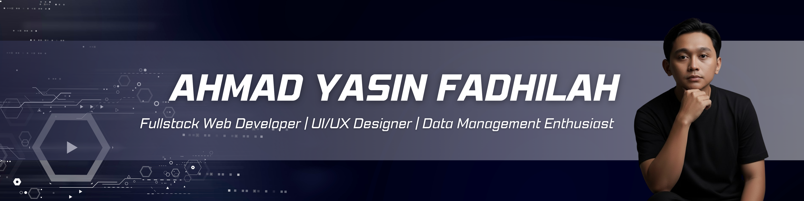
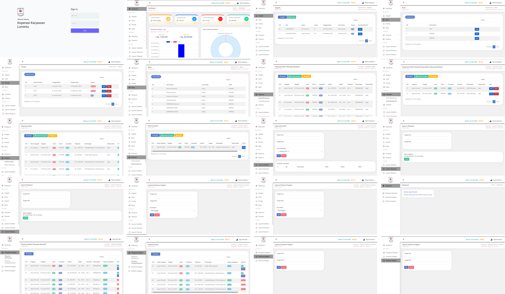

# 👋 Hi, I'm Ahmad Yaasin

**Frontend Web Developer | Fullstack Web Developer | UI/UX Designer | Data Management Enthusiast | IT Administrator**  
*Turning ideas into scalable digital solutions 💡*

.svg)

---

## 🚀 Quick Navigation
- [About Me](#-about-me)
- [Tech Stack](#-tech-stack)
- [Social Links](#-social-links)
- [Featured Projects](#-featured-projects)
- [GitHub Stats](#-github-stats)
- [Achievements](#-achievements)

---
## 🌐 Social Links
  

---

## 💫 About Me
**Tech enthusiast and Informatics graduate passionate about creating impactful digital solutions to real-world challenges.**  
Currently deepening my expertise in **Python**, exploring its potential in **data science**, **AI**, and **web development**, while collaborating on various **open-source** and **freelance** projects to sharpen both technical and creative skills.  

---

## 💻 Tech Stack

---

## 🌐 Website Projects

### 🛒 Financial Management App Koperasi
**Tech Stack:** HTML, SCSS, JavaScript  
📄 A web-based application for Koperasi Karyawan PLN Lumintu  that simplifies the management of member data, savings, loans, and financial reports. Designed to be efficient, accurate, and transparent, it supports the digitalization of cooperative finance through real-time tracking and a user-friendly interface..

📁 [Repo](https://github.com/yaasin36/ManajemenKoperasi)  

---

### 🏪 Website Cafe Sejuk
**Tech Stack:** HTML, SCSS, JavaScript  
📄 This website provides information about Cafe Sejuk, including its menu, location, and atmosphere. It features a modern, responsive, and user-friendly design, allowing visitors to easily explore and learn more about the café online.

📁 [Repo](https://github.com/yaasin36/WebsiteCafeSejuk)  

---

### 💼 Financial Management Coorporate
**Tech Stack:** Laravel, PHP, CSS  
📄 A web-based financial management system built with Laravel to manage income, expenses, and financial reports efficiently. Designed for corporate use, it ensures data accuracy, automation, and easy monitoring of financial activities through a clean and secure interface.
📁 [Repo](https://github.com/yaasin36/PencatatanKeuangan)  

---

## 📊 GitHub Stats
  

---

## 🏅 Achievements
* 🎓 Bachelor’s Degree in Informatics Engineering, Universitas Dian Nuswantoro, GPA 3.55
* 💻 Fullstack Web Developer, Kampus Merdeka x Gamelab Indonesia
* 🧠 Experienced in Laravel-based web financial applications
* 💼 Web Developer Intern, Koperasi Karyawan PLN Lumintu – improved financial data management
* 🏢 IT Staff, CV Garuda Karya Solution – internal system & digital asset management
* 📑 Passed TOEFL Post-Test (CFLT) on first attempt
* 🏅 Certified in Ethical Hacking (Digital Talent) & Video Content Creation for Higher Education

---

>>>>>>> 43848b1 (update)
